# Software Architecture Documentation
## To-Do Application

**Document Version:** 1.0  
**Date:** February 4, 2026  
**Architecture Pattern:** Clean Architecture + Domain-Driven Design  
**Technology Stack:** Java Spring Boot (Backend) + React (Frontend)

---

## Table of Contents

1. [System Architecture Overview](#system-architecture-overview)
2. [Sequence Diagrams](#sequence-diagrams)
3. [Class Diagrams](#class-diagrams)
4. [Component Diagrams](#component-diagrams)
5. [Deployment Architecture](#deployment-architecture)

---

## System Architecture Overview

The To-Do Application follows **Clean Architecture** principles with **Domain-Driven Design (DDD)** patterns. The system is organized into distinct layers with clear separation of concerns:

- **Presentation Layer (React Frontend)**: User interface and client-side logic
- **API Layer (Spring Boot Controllers)**: REST endpoints and request/response handling
- **Application Layer (Services)**: Business logic orchestration and use cases
- **Domain Layer**: Core business entities and domain logic
- **Infrastructure Layer**: Data persistence, external integrations, and cross-cutting concerns

---

## Sequence Diagrams

Sequence diagrams illustrate the interaction flow between different components for major operations. Each diagram shows the complete request-response cycle from user action to database persistence.

### 1. User Authentication (Login)

This diagram shows the authentication flow when a user logs in with username/password or SSO token.

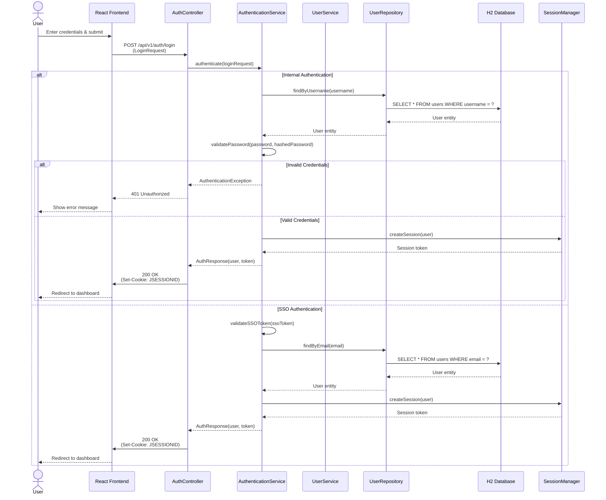

**Explanation:**
- The React frontend sends login credentials to the AuthController
- AuthenticationService handles both internal (username/password) and SSO authentication flows
- UserRepository queries the database to find the user
- Password validation uses bcrypt for secure comparison
- Upon successful authentication, a session is created and a cookie is set
- The user is redirected to the dashboard with their profile information

---

### 2. Create Task

This diagram illustrates the task creation flow, including validation, persistence, and notification.

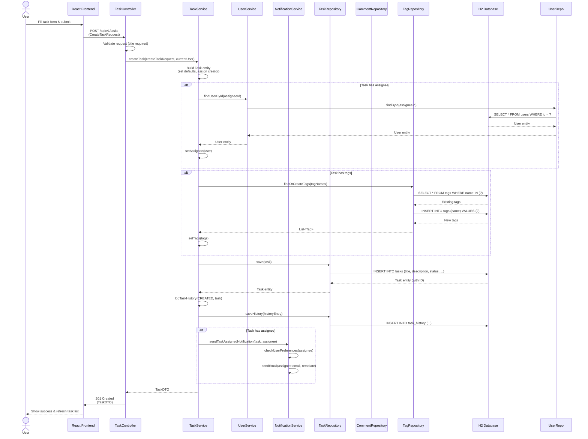

**Explanation:**
- The frontend sends a CreateTaskRequest with task details
- TaskService orchestrates the creation process:
  - Validates and sets default values (status: TO_DO, priority: MEDIUM)
  - Resolves assignee if provided
  - Creates or finds tags
  - Persists the task to the database
  - Logs the creation event in task history
  - Sends notification to assignee if applicable
- The created task is returned as a DTO to the frontend

---

### 3. Assign/Reassign Task

This diagram shows the task assignment flow, including permission checks and notifications.

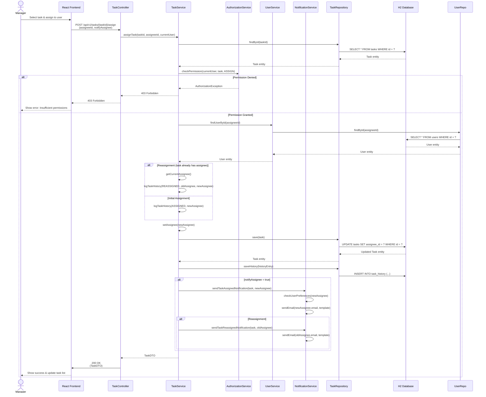

**Explanation:**
- AuthorizationService checks if the current user has permission to assign/reassign tasks
- Managers and Admins can reassign tasks; regular users can only assign tasks they create
- Task history is logged for audit purposes
- Notifications are sent to both the new assignee and previous assignee (if reassignment)
- User notification preferences are respected

---

### 4. Add Comment to Task

This diagram shows the comment creation flow with notification handling.

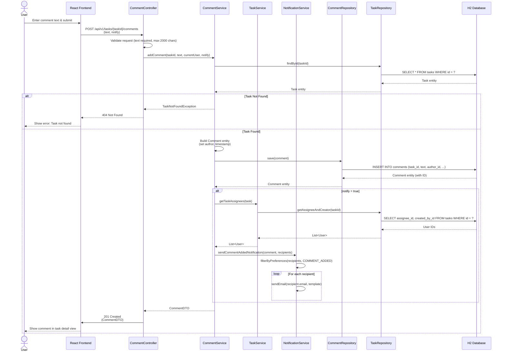

**Explanation:**
- CommentService validates the task exists before creating the comment
- Comments are automatically timestamped and linked to the author
- Notifications are sent to task assignee and creator (if enabled in preferences)
- The comment is immediately returned to update the UI

---

### 5. Generate Completed Tasks Report

This diagram illustrates the report generation flow for managers and admins.

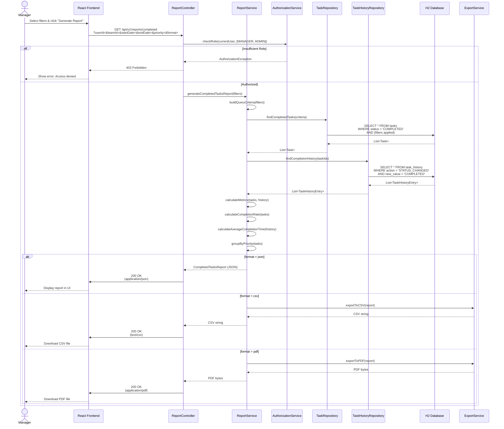

**Explanation:**
- Report generation requires Manager or Admin role
- ReportService aggregates data from tasks and task history
- Metrics are calculated: completion rate, average completion time, breakdown by priority
- Reports can be exported in multiple formats (JSON, CSV, PDF)
- ExportService handles format conversion

---

### 6. Update Task Status

This diagram shows the task status update flow with state transition validation.

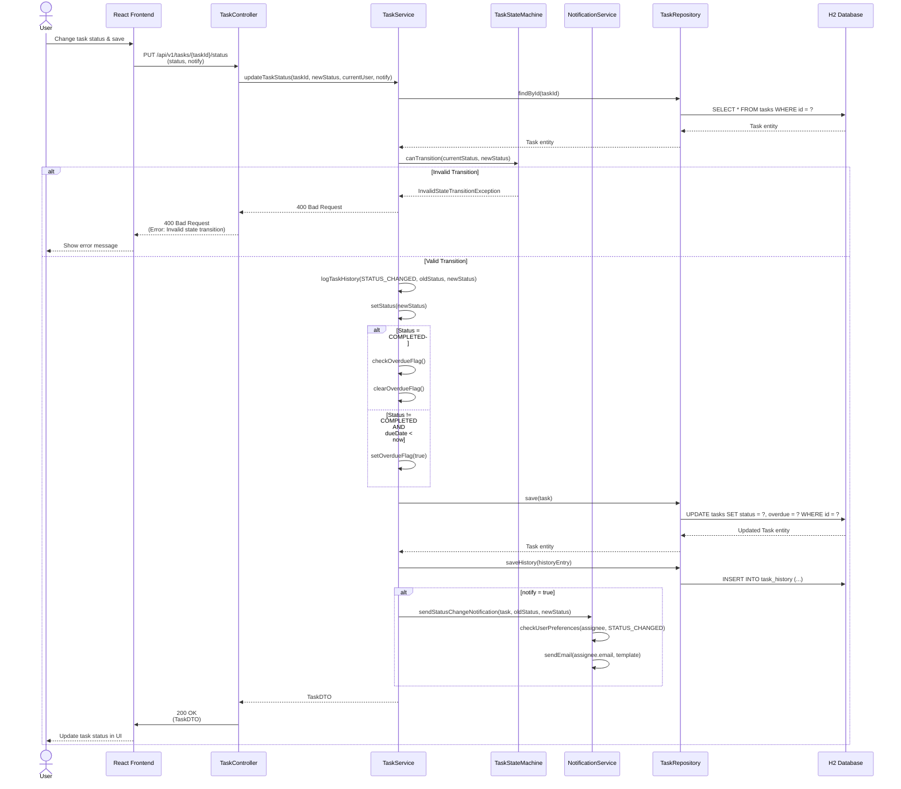

**Explanation:**
- TaskStateMachine validates state transitions (e.g., TO_DO → IN_PROGRESS → COMPLETED)
- Invalid transitions are rejected with a clear error message
- Overdue flag is automatically updated based on status and due date
- Status changes are logged in task history for audit
- Notifications are sent if enabled in user preferences

---

## Class Diagrams

Class diagrams illustrate the structure of domain entities, DTOs, services, and controllers, showing relationships and dependencies.

### 1. Domain Entities (Domain Layer)

This diagram shows the core domain entities and their relationships.

```mermaid
classDiagram
    class Task {
        -String id
        -String title
        -String description
        -TaskStatus status
        -TaskPriority priority
        -LocalDateTime dueDate
        -Boolean overdue
        -LocalDateTime createdAt
        -LocalDateTime updatedAt
        +assign(User assignee)
        +updateStatus(TaskStatus newStatus)
        +addComment(Comment comment)
        +addTag(Tag tag)
        +markOverdue()
        +clearOverdue()
    }
    
    class User {
        -String id
        -String username
        -String email
        -String firstName
        -String lastName
        -UserRole role
        -Boolean active
        -String passwordHash
        -LocalDateTime createdAt
        -LocalDateTime updatedAt
        +hasRole(UserRole role) boolean
        +isActive() boolean
    }
    
    class Comment {
        -String id
        -String text
        -LocalDateTime createdAt
        -LocalDateTime updatedAt
        +canEdit(User user) boolean
        +canDelete(User user) boolean
    }
    
    class Tag {
        -String id
        -String name
        -Integer usageCount
        +incrementUsage()
        +decrementUsage()
    }
    
    class TaskHistory {
        -String id
        -String taskId
        -HistoryAction action
        -String field
        -String oldValue
        -String newValue
        -LocalDateTime performedAt
    }
    
    class NotificationPreferences {
        -String userId
        -Boolean emailEnabled
        -Boolean taskAssigned
        -Boolean taskReassigned
        -Boolean dueDateReminder
        -List~Integer~ reminderDaysBefore
        -Boolean overdueNotification
        -String overdueNotificationFrequency
        -Boolean commentAdded
        -Boolean statusChanged
    }
    
    class UserPreferences {
        -String userId
        -String timezone
        -String dateFormat
        -String timeFormat
        -String language
        -String theme
    }
    
    enum TaskStatus {
        TO_DO
        IN_PROGRESS
        BLOCKED
        COMPLETED
        CANCELLED
    }
    
    enum TaskPriority {
        LOW
        MEDIUM
        HIGH
        CRITICAL
    }
    
    enum UserRole {
        USER
        MANAGER
        ADMIN
    }
    
    enum HistoryAction {
        CREATED
        STATUS_CHANGED
        ASSIGNED
        REASSIGNED
        UPDATED
        DELETED
    }
    
    Task "1" --> "*" Comment : contains
    Task "*" --> "*" Tag : tagged with
    Task "1" --> "*" TaskHistory : has history
    Task "1" --> "0..1" User : assigned to
    Task "1" --> "1" User : created by
    Comment "1" --> "1" User : authored by
    User "1" --> "1" NotificationPreferences : has
    User "1" --> "1" UserPreferences : has
    Task --> TaskStatus
    Task --> TaskPriority
    User --> UserRole
    TaskHistory --> HistoryAction
```

**Explanation:**
- **Task** is the aggregate root, containing Comments and Tags
- **User** is a separate aggregate root with role-based access
- **TaskHistory** provides audit trail for all task changes
- **NotificationPreferences** and **UserPreferences** are value objects associated with User
- Enums define valid states and types (Status, Priority, Role, Action)
- Relationships show cardinality (1-to-many, many-to-many)

---

### 2. DTOs and Request/Response Objects (Presentation Layer)

This diagram shows the data transfer objects used for API communication.

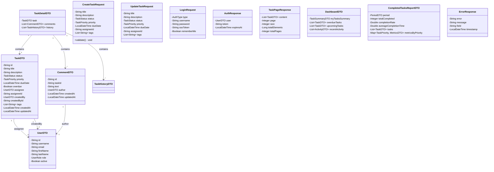

**Explanation:**
- **DTOs** (Data Transfer Objects) separate API contracts from domain entities
- **Request objects** contain validation logic for incoming data
- **Response objects** structure data for frontend consumption
- **PageResponse** provides pagination metadata
- **ErrorResponse** standardizes error messages
- DTOs reference other DTOs (e.g., TaskDTO contains UserDTO)

---

### 3. Service Layer (Application Layer)

This diagram shows the service classes and their dependencies.

```mermaid
classDiagram
    class TaskService {
        -TaskRepository taskRepository
        -UserRepository userRepository
        -TagRepository tagRepository
        -TaskHistoryRepository historyRepository
        -TaskMapper taskMapper
        -NotificationService notificationService
        -TaskStateMachine stateMachine
        +createTask(CreateTaskRequest, User) TaskDTO
        +updateTask(String, UpdateTaskRequest, User) TaskDTO
        +deleteTask(String, User) void
        +assignTask(String, String, User) TaskDTO
        +updateTaskStatus(String, TaskStatus, User) TaskDTO
        +getTaskById(String, User) TaskDetailDTO
        +listTasks(TaskFilter, Pageable, User) TaskPageResponse
        -validatePermissions(User, Task, Action) void
        -logTaskHistory(Task, HistoryAction) void
    }
    
    class CommentService {
        -CommentRepository commentRepository
        -TaskRepository taskRepository
        -CommentMapper commentMapper
        -NotificationService notificationService
        +addComment(String, String, User, Boolean) CommentDTO
        +updateComment(String, String, String, User) CommentDTO
        +deleteComment(String, String, User) void
        +getTaskComments(String) List~CommentDTO~
        -canEditComment(Comment, User) boolean
    }
    
    class UserService {
        -UserRepository userRepository
        -UserMapper userMapper
        +createUser(CreateUserRequest) UserDTO
        +updateUser(String, UpdateUserRequest, User) UserDTO
        +deleteUser(String, User) void
        +getUserById(String) UserDTO
        +listUsers(UserFilter, Pageable) UserPageResponse
        +getCurrentUser() UserDTO
    }
    
    class AuthenticationService {
        -UserRepository userRepository
        -PasswordEncoder passwordEncoder
        -SessionManager sessionManager
        -SSOProvider ssoProvider
        +authenticate(LoginRequest) AuthResponse
        +logout(String) void
        +refreshSession(String) AuthResponse
        +requestPasswordReset(String) void
        +confirmPasswordReset(String, String) void
        -validatePassword(String, String) boolean
        -validateSSOToken(String) UserInfo
    }
    
    class ReportService {
        -TaskRepository taskRepository
        -TaskHistoryRepository historyRepository
        -UserRepository userRepository
        -ExportService exportService
        +generateCompletedTasksReport(ReportFilter) CompletedTasksReportDTO
        +generateOverdueTasksReport(ReportFilter) OverdueTasksReportDTO
        +generateProductivityReport(ProductivityFilter) ProductivityReportDTO
        -calculateMetrics(List~Task~, List~TaskHistory~) MetricsDTO
        -calculateCompletionRate(List~Task~) double
        -calculateAverageCompletionTime(List~TaskHistory~) double
    }
    
    class NotificationService {
        -EmailService emailService
        -NotificationPreferencesRepository preferencesRepository
        -NotificationTemplateService templateService
        +sendTaskAssignedNotification(Task, User) void
        +sendTaskReassignedNotification(Task, User, User) void
        +sendDueDateReminder(Task, User) void
        +sendOverdueNotification(Task, User) void
        +sendCommentAddedNotification(Comment, List~User~) void
        +sendStatusChangeNotification(Task, TaskStatus, TaskStatus) void
        -shouldSendNotification(User, NotificationType) boolean
        -sendEmail(User, String, Map~String, Object~) void
    }
    
    class DashboardService {
        -TaskRepository taskRepository
        -TaskHistoryRepository historyRepository
        +getDashboard(User) DashboardDTO
        +getMyTasksSummary(User) TaskSummaryDTO
        +getOverdueTasks(User, Integer) List~TaskDTO~
        +getUpcomingTasks(User, Integer) List~TaskDTO~
        +getRecentActivity(User, Integer) List~ActivityDTO~
    }
    
    class TagService {
        -TagRepository tagRepository
        +listTags(String, Integer) List~TagDTO~
        +getTagDetails(String) TagDetailDTO
        +findOrCreateTags(List~String~) List~Tag~
    }
    
    class AuthorizationService {
        -UserRepository userRepository
        +checkPermission(User, Object, Action) boolean
        +checkRole(User, List~UserRole~) boolean
        -hasPermission(User, Task, Action) boolean
    }
    
    TaskService --> TaskRepository
    TaskService --> UserRepository
    TaskService --> TagRepository
    TaskService --> TaskHistoryRepository
    TaskService --> NotificationService
    TaskService --> AuthorizationService
    CommentService --> CommentRepository
    CommentService --> TaskRepository
    CommentService --> NotificationService
    UserService --> UserRepository
    AuthenticationService --> UserRepository
    AuthenticationService --> SessionManager
    ReportService --> TaskRepository
    ReportService --> TaskHistoryRepository
    ReportService --> ExportService
    DashboardService --> TaskRepository
    DashboardService --> TaskHistoryRepository
    NotificationService --> EmailService
    NotificationService --> NotificationPreferencesRepository
```

**Explanation:**
- Services orchestrate business logic and coordinate between repositories
- **TaskService** is the primary service for task operations
- **AuthorizationService** centralizes permission checks
- **NotificationService** handles all notification logic
- **ReportService** aggregates data for reporting
- Services depend on repositories for data access and other services for cross-cutting concerns

---

### 4. Controller Layer (Presentation Layer)

This diagram shows the REST controllers and their relationships.

```mermaid
classDiagram
    class TaskController {
        -TaskService taskService
        +createTask(CreateTaskRequest, Principal) ResponseEntity~TaskDTO~
        +getTask(String, Principal) ResponseEntity~TaskDetailDTO~
        +updateTask(String, UpdateTaskRequest, Principal) ResponseEntity~TaskDTO~
        +deleteTask(String, Principal) ResponseEntity~void~
        +listTasks(TaskFilter, Pageable, Principal) ResponseEntity~TaskPageResponse~
        +assignTask(String, AssignTaskRequest, Principal) ResponseEntity~TaskDTO~
        +updateTaskStatus(String, UpdateStatusRequest, Principal) ResponseEntity~TaskDTO~
        +getTaskHistory(String, Principal) ResponseEntity~List~TaskHistoryDTO~~
    }
    
    class CommentController {
        -CommentService commentService
        +addComment(String, CreateCommentRequest, Principal) ResponseEntity~CommentDTO~
        +getTaskComments(String, Principal) ResponseEntity~List~CommentDTO~~
        +updateComment(String, String, UpdateCommentRequest, Principal) ResponseEntity~CommentDTO~
        +deleteComment(String, String, Principal) ResponseEntity~void~
    }
    
    class AuthController {
        -AuthenticationService authService
        +login(LoginRequest, HttpServletResponse) ResponseEntity~AuthResponse~
        +logout(HttpServletRequest, HttpServletResponse) ResponseEntity~MessageResponse~
        +refreshSession(HttpServletRequest) ResponseEntity~AuthResponse~
        +requestPasswordReset(PasswordResetRequest) ResponseEntity~MessageResponse~
        +confirmPasswordReset(ConfirmPasswordResetRequest) ResponseEntity~MessageResponse~
    }
    
    class UserController {
        -UserService userService
        +createUser(CreateUserRequest, Principal) ResponseEntity~UserDTO~
        +getUser(String, Principal) ResponseEntity~UserDTO~
        +updateUser(String, UpdateUserRequest, Principal) ResponseEntity~UserDTO~
        +deleteUser(String, Principal) ResponseEntity~void~
        +listUsers(UserFilter, Pageable, Principal) ResponseEntity~UserPageResponse~
        +getCurrentUser(Principal) ResponseEntity~UserDTO~
        +getUserPreferences(Principal) ResponseEntity~UserPreferencesDTO~
        +updateUserPreferences(UserPreferencesDTO, Principal) ResponseEntity~UserPreferencesDTO~
    }
    
    class DashboardController {
        -DashboardService dashboardService
        +getDashboard(Principal) ResponseEntity~DashboardDTO~
        +getMyTasksSummary(Principal) ResponseEntity~TaskSummaryDTO~
        +getOverdueTasks(Integer, Principal) ResponseEntity~List~TaskDTO~~
        +getUpcomingTasks(Integer, Principal) ResponseEntity~List~TaskDTO~~
        +getRecentActivity(Integer, Principal) ResponseEntity~List~ActivityDTO~~
    }
    
    class ReportController {
        -ReportService reportService
        +getCompletedTasksReport(ReportFilter, String, Principal) ResponseEntity
        +getOverdueTasksReport(ReportFilter, String, Principal) ResponseEntity
        +getProductivityReport(ProductivityFilter, Principal) ResponseEntity~ProductivityReportDTO~
    }
    
    class TagController {
        -TagService tagService
        +listTags(String, Integer) ResponseEntity~List~TagDTO~~
        +getTagDetails(String) ResponseEntity~TagDetailDTO~
    }
    
    class NotificationController {
        -NotificationService notificationService
        +getNotificationPreferences(Principal) ResponseEntity~NotificationPreferencesDTO~
        +updateNotificationPreferences(NotificationPreferencesDTO, Principal) ResponseEntity~NotificationPreferencesDTO~
    }
    
    class HealthController {
        +healthCheck() ResponseEntity~HealthStatus~
        +readinessCheck() ResponseEntity~HealthStatus~
        +livenessCheck() ResponseEntity~HealthStatus~
    }
    
    class GlobalExceptionHandler {
        +handleValidationException(ValidationException) ResponseEntity~ErrorResponse~
        +handleNotFoundException(NotFoundException) ResponseEntity~ErrorResponse~
        +handleAuthorizationException(AuthorizationException) ResponseEntity~ErrorResponse~
        +handleException(Exception) ResponseEntity~ErrorResponse~
    }
    
    TaskController --> TaskService
    CommentController --> CommentService
    AuthController --> AuthenticationService
    UserController --> UserService
    DashboardController --> DashboardService
    ReportController --> ReportService
    TagController --> TagService
    NotificationController --> NotificationService
```

**Explanation:**
- Controllers handle HTTP requests and responses
- Each controller delegates to a corresponding service
- **Principal** represents the authenticated user (injected by Spring Security)
- **GlobalExceptionHandler** centralizes error handling
- Controllers return **ResponseEntity** for flexible HTTP responses
- Controllers are thin - they validate input and delegate to services

---

## Component Diagrams

### 1. Application Layers (Clean Architecture)

This diagram shows the layered architecture with component dependencies.

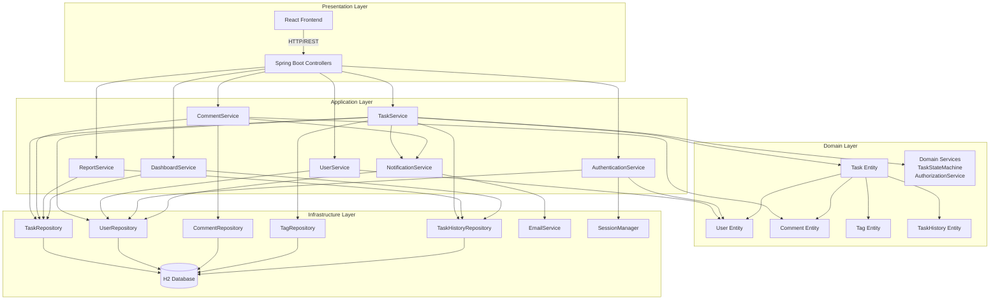

**Explanation:**
- **Presentation Layer**: React frontend communicates with Spring Boot controllers via REST API
- **Application Layer**: Services orchestrate business logic and coordinate between layers
- **Domain Layer**: Core entities and domain logic (business rules, state machines)
- **Infrastructure Layer**: Data persistence (repositories) and external services (email, sessions)
- Dependencies flow inward: outer layers depend on inner layers, not vice versa
- Domain layer has no dependencies on other layers (pure business logic)

---

### 2. Service Dependencies

This diagram shows how services interact with each other.

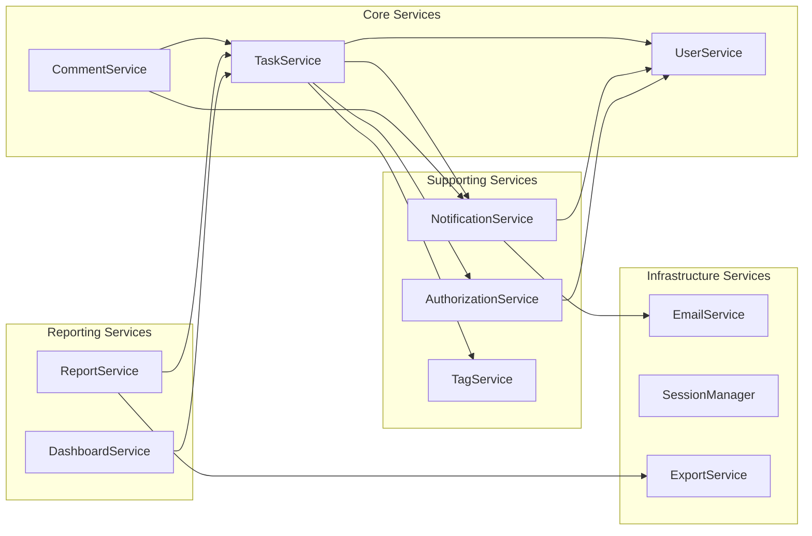

**Explanation:**
- **Core Services** (TaskService, UserService) are central to the application
- **Supporting Services** provide cross-cutting functionality (notifications, authorization)
- **Reporting Services** aggregate data from core services
- **Infrastructure Services** handle external integrations
- Services communicate through well-defined interfaces

---

## Architecture Diagram

### Full-Stack Architecture Overview

This comprehensive diagram shows the complete system architecture including frontend, backend, database, and external integrations.

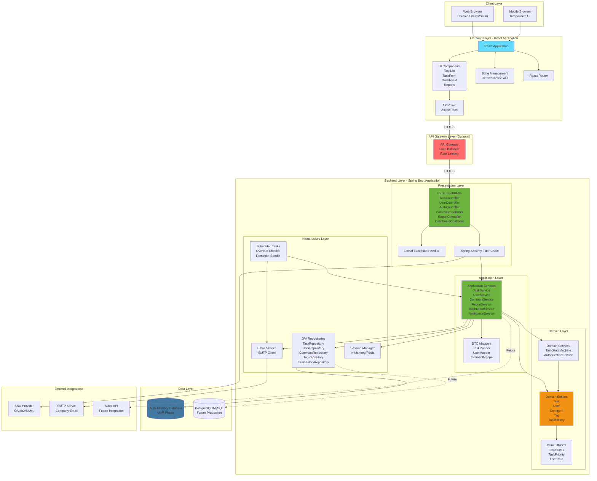

**Explanation:**

**Client Layer:**
- Web browsers and mobile browsers access the React application
- Responsive design ensures compatibility across devices

**Frontend Layer (React):**
- **React Application**: Single Page Application (SPA)
- **Components**: Reusable UI components for tasks, users, dashboard, reports
- **State Management**: Centralized state (Redux or Context API)
- **API Client**: HTTP client for backend communication
- **Routing**: Client-side routing for navigation

**API Gateway (Optional):**
- Load balancing and request distribution
- Rate limiting and throttling
- SSL termination
- Request/response transformation

**Backend Layer (Spring Boot):**
- **Presentation Layer**: REST controllers handle HTTP requests, Spring Security enforces authentication/authorization
- **Application Layer**: Services orchestrate business logic, mappers convert between entities and DTOs
- **Domain Layer**: Core business entities and domain logic (state machines, business rules)
- **Infrastructure Layer**: Data access (JPA repositories), external services (email, sessions), scheduled tasks

**Data Layer:**
- **H2 Database**: In-memory database for MVP
- **Future Database**: PostgreSQL/MySQL for production (migration path)

**External Integrations:**
- **SSO Provider**: OAuth2/SAML for single sign-on
- **Email Server**: SMTP for notifications
- **Future Integrations**: Slack API for notifications (out of scope for MVP)

**Communication Flow:**
1. User interacts with React UI
2. React makes API calls to Spring Boot backend
3. Controllers validate and delegate to services
4. Services execute business logic using domain entities
5. Repositories persist/retrieve data from database
6. Responses flow back through layers to React UI
7. Scheduled tasks run in background for automation (overdue checks, reminders)

---

## Deployment Architecture

### Containerized Deployment (Docker)

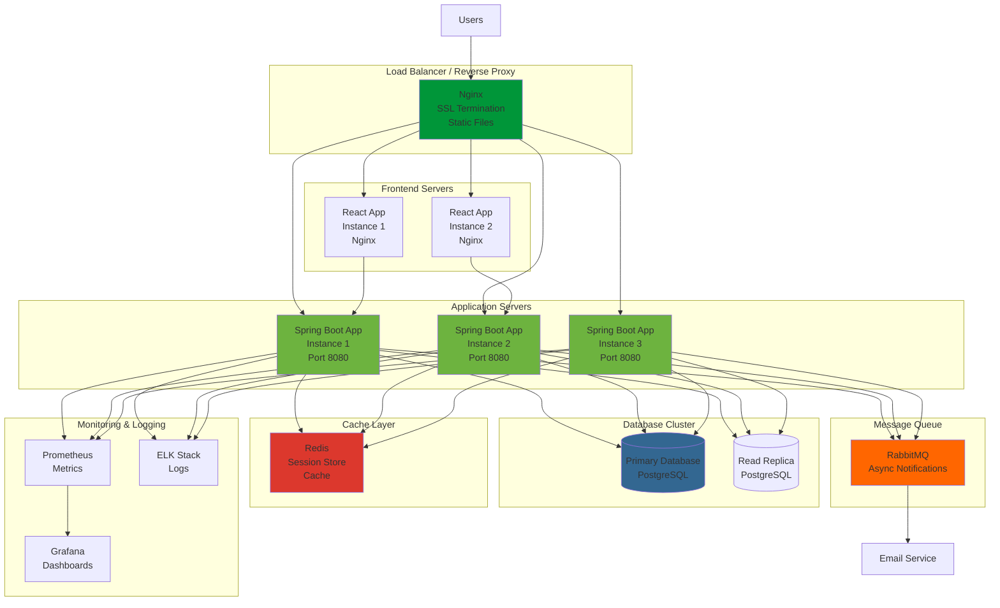

**Explanation:**

**Load Balancer:**
- Nginx handles SSL termination and routes requests to application servers
- Serves static React build files

**Application Servers:**
- Multiple Spring Boot instances for high availability and load distribution
- Horizontal scaling capability

**Frontend Servers:**
- React applications served via Nginx
- Can be CDN-hosted for better performance

**Database:**
- Primary database for writes
- Read replicas for scaling read operations
- Future migration from H2 to PostgreSQL

**Cache Layer:**
- Redis for session storage and caching frequently accessed data

**Message Queue:**
- RabbitMQ for asynchronous notification processing
- Decouples notification sending from request handling

**Monitoring:**
- Prometheus collects metrics
- Grafana visualizes metrics
- ELK stack aggregates and analyzes logs

---

## Key Design Patterns

### 1. Repository Pattern
- Abstracts data access logic
- Enables easy database switching (H2 → PostgreSQL)
- Provides testability with mock repositories

### 2. Service Layer Pattern
- Encapsulates business logic
- Coordinates between repositories and domain entities
- Handles transactions

### 3. DTO Pattern
- Separates API contracts from domain models
- Prevents entity exposure to presentation layer
- Enables API versioning

### 4. State Machine Pattern
- Manages task status transitions
- Ensures valid state changes
- Centralizes state transition logic

### 5. Strategy Pattern
- Notification strategies (email, future: Slack)
- Export strategies (CSV, PDF, JSON)
- Authentication strategies (internal, SSO)

### 6. Observer Pattern
- Task events trigger notifications
- Decoupled notification system
- Extensible for future notification channels

---

## Technology Stack Summary

### Frontend
- **Framework**: React 18+
- **State Management**: Redux Toolkit or Context API
- **Routing**: React Router
- **HTTP Client**: Axios
- **UI Library**: Material-UI or Ant Design
- **Build Tool**: Vite or Create React App

### Backend
- **Framework**: Spring Boot 3.x
- **Language**: Java 17+
- **Security**: Spring Security
- **ORM**: Spring Data JPA
- **Validation**: Bean Validation (Jakarta)
- **API Documentation**: SpringDoc OpenAPI (Swagger)

### Database
- **MVP**: H2 In-Memory Database
- **Production**: PostgreSQL or MySQL
- **Migrations**: Flyway or Liquibase

### Infrastructure
- **Containerization**: Docker
- **Orchestration**: Docker Compose (dev), Kubernetes (prod)
- **CI/CD**: GitHub Actions or Jenkins
- **Monitoring**: Prometheus + Grafana
- **Logging**: Logback + ELK Stack

---

## Security Architecture

### Authentication Flow
1. User submits credentials
2. Spring Security validates credentials
3. Session created and cookie set (HttpOnly, Secure)
4. Subsequent requests include session cookie
5. Spring Security validates session

### Authorization Flow
1. Request arrives at controller
2. Spring Security extracts user from session
3. AuthorizationService checks user role and permissions
4. Access granted or denied based on RBAC rules

### Data Protection
- HTTPS/TLS for all communications
- Password hashing with bcrypt
- SQL injection prevention (parameterized queries)
- XSS prevention (input sanitization)
- CSRF protection (Spring Security)

---

## Performance Considerations

### Caching Strategy
- **User Data**: Cache user profiles in Redis
- **Task Lists**: Cache frequently accessed task lists
- **Reports**: Cache generated reports for short duration
- **Tags**: Cache tag list (rarely changes)

### Database Optimization
- Indexes on frequently queried fields (status, assignee_id, due_date)
- Pagination for large result sets
- Query optimization (avoid N+1 queries)

### Frontend Optimization
- Code splitting and lazy loading
- Image optimization
- API response caching
- Debouncing for search inputs

---

## Scalability Considerations

### Horizontal Scaling
- Stateless application servers (session stored in Redis)
- Load balancer distributes requests
- Database read replicas for read scaling

### Vertical Scaling
- Increase server resources (CPU, memory)
- Database connection pooling
- JVM tuning for Spring Boot

### Future Enhancements
- Microservices architecture (if needed)
- Event-driven architecture for notifications
- CQRS pattern for read/write separation
- Message queue for async processing

---

**Document Status:** Complete  
**Next Steps:** Implementation planning, database schema design, API development
